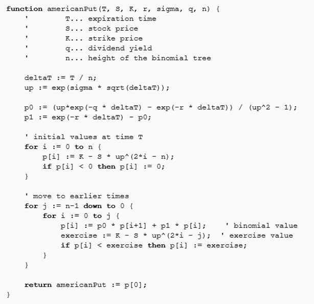

# Binomial Options Pricing Model

The goal of this reference design (tutorial) is to:
 - Demonstrate performance advantage of the Xilinx Alveo-based solution vs. the Intel® Xeon® CPU one and
 - Introduce various SDAccel analysis tools and optimization techniques allowing you to significantly improve design performance

by using a Binomial Options Pricing Model (further referenced as <b>Binomial Model</b>). The original description of the Binomial Model was obtained from [Wikipedia] and is presented on the following figure:

  

This original algorithm was rewritten in a C/C++ programming language by using single precision floating point operations and keeping the coding style as close as possible to the original version.

At the beginning, you will use the original C/C++ Binomial Model description to target both Xilinx Alveo card and x68 CPU. You will observe that a fully sequential execution of the application on the Alveo card outperforms the single threaded CPU implementation by the factor of <b>8.9x</b>.

Then by using various optimization methods you will be able to increase Alveo based performance by the factor of <b>60x</b>. This is represented in the following reduced summary table:

Design    | CPU (ms)           | Alveo (ms) | Alveo Gain vs. CPU |
----------|-------------------:|-----------:|-------------------:|
Original  | 1 Thread: 9834.2   |     1106.7 | <b>8.9x</b>        |
Optimized | 12 Threads: 1289.7 |       18.2 | <b>70.9x</b>       |
 
This tutorial was validated using
 - <b>U200</b> Alveo card with <b>2019.1</b> XRT, deployment and development shells
 - SDAccel <b>2019.1</b> version

All results represented in this tutorial were generated by using <b>DELL 8510 Workstation</b> with the following characteristics:
 - <b>CPU</b>: Intel® Xeon® E5-1650 v3 @ 3.50 GHz  
   Treads per core: 6  
   Cores per socket: 2
 - <b>RAM</b>: 64 GB
 - <b>OS</b>: CentOS 7.4

Please refer to the [BinomialModel.pdf] document for detailed information regarding design setup, execution and results comparison.

[Wikipedia]: https://en.wikipedia.org/wiki/Binomial_options_pricing_model
[BinomialModel.pdf]: BinomialModel.pdf
